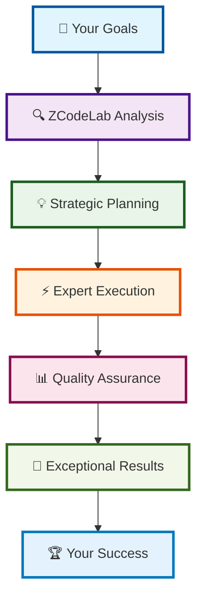

# ZCodeLab
## 🌟 Professional Services & Technology Solutions 🌟

**✨ Your Gateway to Professional Excellence & Innovation ✨**

---

## 🎯 **About ZCodeLab**

> ### 🌟 **"Your trusted partner in professional growth and technical innovation"** 🌟

<table>
<tr>
<td>

**ZCodeLab** is a cutting-edge professional services platform that bridges the gap between **ambition** and **achievement**. We specialize in transforming careers, accelerating research, and delivering world-class technical solutions with **unprecedented quality** and **lightning-fast delivery**.

</td>
<td>

</td>
</tr>
</table>

### 🌟 **Why ZCodeLab Stands Out?**

| 🔒 **100% Confidential** | ⚡ **Lightning Fast** | 🎯 **Results-Driven** | 🌍 **Global Reach** |
|:------------------------:|:---------------------:|:----------------------:|:--------------------:|
| Your privacy is sacred | On-time delivery guaranteed | Measurable outcomes only | Remote services worldwide |

---

## 💼 **Our Premium Services Portfolio**

### 🚀 **Choose Your Path to Success** 🚀

<table>
<tr>
<td width="50%" valign="top">

### 🚀 **Career Development**
*Transform your professional journey*

**🎯 Our Expertise:**
- 📝 **Resume & CV Crafting** - ATS-optimized, industry-specific profiles
- 💼 **LinkedIn Optimization** - Stand out to top recruiters globally
- 🎤 **Interview Mastery** - Confidence-building & strategy sessions
- 🌟 **Career Mentorship** - Personalized growth roadmaps
- 💰 **Salary Negotiation** - Maximize your earning potential

</td>
<td width="50%" valign="top">

### 🔬 **Academic Research**
*Accelerate your research excellence*

**📊 Our Expertise:**
- 📊 **Research Paper Excellence** - Publication-ready, peer-reviewed quality
- 🧬 **Molecular Dynamics Simulations** - Advanced computational modeling
- 📖 **Thesis Support** - End-to-end PhD/Masters guidance
- 📈 **Data Analysis** - Statistical insights & professional visualization
- 🔍 **Literature Reviews** - Comprehensive research foundations

</td>
</tr>
<tr>
<td width="50%" valign="top">

### 🛡️ **Cybersecurity & Tech**
*Secure your digital future*

**🔐 Our Expertise:**
- 🔐 **Security Audits** - AI-powered threat detection & analysis
- 🐍 **Python Development** - Custom automation & scripting solutions
- 🖥️ **System Administration** - Windows, Linux & cloud expertise
- 🔧 **Troubleshooting** - Hardware & software optimization
- 🌐 **Network Security** - Penetration testing & vulnerability assessment

</td>
<td width="50%" valign="top">

### ⚙️ **Custom Development**
*Build tomorrow's technology today*

**💻 Our Expertise:**
- 🌐 **Web Applications** - Modern, responsive, scalable designs
- 🤖 **AI/ML Solutions** - Intelligent automation & predictive analytics
- 🧪 **Research Tools** - Protein-ligand docking & molecular visualization
- 💡 **Technical Consultation** - Strategic technology planning
- 📱 **Mobile Development** - Cross-platform app solutions

</td>
</tr>
</table>

---

## 🛠️ **Our Technology Arsenal**

### ⚡ **Powered by Cutting-Edge Technology** ⚡

<table align="center">
<tr>
<th>🎨 Frontend</th>
<th>⚙️ Backend</th>
<th>🔧 Tools & Frameworks</th>
<th>☁️ Cloud & DevOps</th>
</tr>
<tr>
<td align="center">

  
  
  

</td>
<td align="center">

  
  
  

</td>
<td align="center">

  
  
  

</td>
<td align="center">

  
  
  

</td>
</tr>
</table>

---

## 📊 **Our Success Story**

### 🏆 **Numbers That Speak Volumes** 🏆

```mermaid
graph TB
    A[🎯 Your Goals] --> B[🔍 ZCodeLab Analysis]
    B --> C[💡 Strategic Planning]
    C --> D[⚡ Expert Execution]
    D --> E[📊 Quality Assurance]
    E --> F[🚀 Exceptional Results]
    F --> G[🏆 Your Success]
    
    style A fill:#e1f5fe,stroke:#01579b,stroke-width:3px
    style B fill:#f3e5f5,stroke:#4a148c,stroke-width:3px
    style C fill:#e8f5e8,stroke:#1b5e20,stroke-width:3px
    style D fill:#fff3e0,stroke:#e65100,stroke-width:3px
    style E fill:#fce4ec,stroke:#880e4f,stroke-width:3px
    style F fill:#f1f8e9,stroke:#33691e,stroke-width:3px
    style G fill:#e3f2fd,stroke:#0277bd,stroke-width:3px
```

### 📈 **Quality Metrics & Achievements**

| 🎯 Metric | 📊 Result | 🏆 Impact |
|:---------:|:---------:|:---------:|
| **Client Satisfaction** | `99.9%` | 🌟🌟🌟🌟🌟 |
| **Delivery Speed** | `24-48 Hours` | ⚡ Lightning Fast |
| **Data Security** | `Zero Breaches` | 🔒 Fort Knox Level |
| **Successful Projects** | `500+` | 🏆 Proven Excellence |
| **Global Clients** | `50+ Countries` | 🌍 Worldwide Trust |
| **Expert Team** | `24/7 Available` | 👥 Always Here |

---

## 🌐 **Get Started Today**

### 📞 **Contact Our Expert Team**

<table align="center">
<tr>
<th>📧 Email</th>
<th>🌐 Website</th>
<th>🌍 Service Area</th>
<th>⏰ Availability</th>
</tr>
<tr>
<td align="center">

</td>
<td align="center">

</td>
<td align="center">

</td>
<td align="center">

</td>
</tr>
</table>

---

### 🚀 **Ready to Transform Your Future?**

---

### 📄 **Open Source & Legal**

---

**Made with ❤️ by the ZCodeLab Team**  
*🌟 Your Partner in Career Excellence, Research Innovation & Technology Mastery 🌟*

